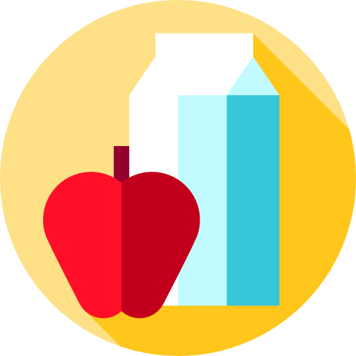

<p align="center">
  <a href="" rel="noopener">
 </a>
</p>

<h3 align="center">Grocery List</h3>

---

<p align="center"> Smart grocery list that autocategorizes your items based on your preferences
    <br> 
</p>

[](https://circleci.com/gh/cortl/grocery-list)
[](https://david-dm.org/cortl/grocery-list.svg)
[](https://david-dm.org/cortl/grocery-list.svg?type=dev)
[](/LICENSE)

## 🚀 Usage

Running over at [https://groceries.cortlan.dev](https://groceries.cortlan.dev)

## 🔧 Getting Started
- [🚀 Usage](#-usage)
- [🔧 Getting Started](#-getting-started)
  - [Configuring Firebase](#configuring-firebase)
  - [💻  Setting up your local environment](#--setting-up-your-local-environment)

### Configuring Firebase
- [Create a new project](https://console.firebase.google.com)
- Go to "Project Settings" and make sure you're on the "General" tab and get ApiKey, SenderId, etc. and copy them into a .env file in the cloned project directory

```dotenv
# Running Prod
REACT_APP_API_KEY="<your-api-key-here>"
REACT_APP_AUTH_DOMAIN="<your-app-domain>"
REACT_APP_DATABASE_URL="<your-data-base-url>"
REACT_APP_PROJECT_ID="<your-project-id>"
REACT_APP_STORAGE_BUCKET="<your-storage-bucket-url>"
REACT_APP_MESSAGING_SENDER_ID="<your-sender-id>"
REACT_APP_APP_ID="<your-app-id>"
```

- On the Firebase console authentication page, turn on Google Sign on method
- On the Firebase console Database page, turn on Firestore

### 💻  Setting up your local environment
- `npm install`
- `npm start`
